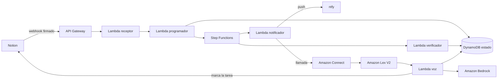

<p align="center">
  <picture>
    <source media="(prefers-color-scheme: dark)" srcset=".github/assets/logo-dark.svg">
    
  </picture>
</p>

# Agente de Tareas

[](https://github.com/aaroncose/agente-tareas/actions/workflows/tests.yml)


[](LICENSE)

La utilidad de este agente es recordar y ayudar a las tareas que apunto en Notion con su hora y su nivel de importancia. 
El sistema me avisa cinco minutos antes mediante notificación push al móvil via ntfy, me llama por teléfono a la 
hora exacta, e insiste según lo importante que sea la tarea.

Al descolgar hablo con un asistente de voz que hasta que la tarea
está resuelta. Le pido que me la desglose en pasos, que me saque de donde me he
atascado o cualquier otra cosa que surja mientras hablamos, y sigue el hilo
de la conversación entera. Cuando colgamos, me deja Notion actualizado.

> **Estado** — Desplegado y funcionando de extremo a extremo sobre AWS,
> incluida la llamada saliente a números españoles.

---

## Arquitectura



Infraestructura definida con AWS CDK v2 en Python, desplegada en `eu-central-1`.

### Qué hace cada pieza

| Componente | Responsabilidad |
|---|---|
| API Gateway | Recibe el webhook de Notion y el atajo manual |
| Lambda `receptor` | Valida la firma HMAC y despacha la tarea |
| Lambda `programador` | Lee la tarea, calcula la línea temporal y arranca la ejecución |
| Step Functions | Espera hasta cada marca horaria y ramifica según el tipo de tarea |
| Lambda `verificador` | Comprueba si ya descolgué antes de lanzar cada reintento |
| Lambda `notificador` | Manda el aviso por ntfy y pide la llamada a Connect |
| Amazon Connect | Telefonía saliente y flujo de contacto |
| Amazon Lex V2 | Reconoce lo que digo en español y sostiene el turno |
| Lambda `voz` | Conduce la conversación y actúa sobre Notion |
| Amazon Bedrock | Genera cada turno del agente con Claude Haiku |
| DynamoDB | Estado de la tarea, control de duplicados e historial de la conversación |
| Secrets Manager | Credenciales de Notion, ntfy y Connect |
| CloudWatch | Registro estructurado y alarmas |

---

## Escalada de avisos

`H` es la hora que apunté en la tarea.

| Tipo | H−5 min | H | H+5 min | H+15 min |
|---|---|---|---|---|
| Normal | aviso | llamada | — | — |
| Importante | aviso | llamada | — | llamada |
| Urgente | aviso | llamada | llamada | llamada |

Cada reintento consulta antes si ya atendí la llamada anterior. En cuanto
descuelgo una vez, la cadena termina.

Los tiempos viven en [`lambdas/programador/handler.py`](lambdas/programador/handler.py)
y están cubiertos por tests.

```python
MIN_ANTES_PUSH = 5
REINTENTO_IMPORTANTE = 15
REINTENTO_URGENTE_1 = 5
REINTENTO_URGENTE_2 = 15
```

---

## La conversación

Al descolgar, Polly lee un saludo con el título de la tarea. A partir de ahí
hablo con el agente de Lex por turnos.

Cada cosa que digo entra por Lex y llega a la Lambda `voz`, que recupera el
historial de la conversación desde DynamoDB, se lo pasa entero a Bedrock y
devuelve un turno nuevo. El historial guarda hasta 12 intercambios.

El agente responde en una o dos frases y termina con una pregunta, así que la
llamada se mantiene abierta hasta que uno de los dos la cierra.

### Cómo se reparten las intenciones

| Intención | Qué pasa |
|---|---|
| `FallbackIntent` | Ruta principal. Todo lo que digo en lenguaje natural llega aquí y lo conduce Bedrock |
| `AyudaIntent` | Entra en el mismo bucle de conversación cuando pido ayuda de forma explícita |
| `HechaIntent` | Atajo directo. Marca la tarea como Hecho en Notion y cuelga |
| `AplazarIntent` | Atajo directo. Recoge la hora nueva, actualiza Notion y reprograma la ejecución |

Los dos atajos cierran la llamada sin pasar por el modelo porque ahí ya sé lo
que quiero hacer.

### Cómo termina la llamada

El modelo marca sus propios turnos. Cuando entiende que la tarea ya está hecha
añade `[HECHA]` al final de su respuesta, y cuando la conversación se da por
terminada añade `[FIN]`. La Lambda retira esos marcadores antes de que suenen,
actualiza Notion si toca y cierra la sesión de Lex.

Al llegar a 12 turnos la conversación se cierra igualmente (lo he configurado así de momento).

---

## Pruebas

```bash
python -m pytest -q
```

| Archivo | Qué cubre |
|---|---|
| [`test_firma_webhook.py`](tests/unit/test_firma_webhook.py) | La firma HMAC que protege mi endpoint público |
| [`test_escalada_llamadas.py`](tests/unit/test_escalada_llamadas.py) | Cuántas veces insisto y con qué margen según el tipo |
| [`test_fechas_notion.py`](tests/unit/test_fechas_notion.py) | Los formatos de fecha que manda Notion y su paso a UTC |
| [`test_agente_tareas_stack.py`](tests/unit/test_agente_tareas_stack.py) | La plantilla de CloudFormation que sintetizo |

Los de la firma son los que más me importan. Mi API Gateway es pública, así que
esa comprobación es lo único que separa a un desconocido de provocar llamadas a
mi número. Cubren la firma correcta, la manipulada, el cuerpo alterado
conservando una firma legítima, la firma hecha con otro secreto y el caso de un
secreto vacío por error de configuración.

GitHub Actions en cada push.

---

## Requisitos

| Requisito | Versión |
|---|---|
| Python | 3.13 o superior |
| Node.js | 22 o superior |
| AWS CDK | 2.x |
| Cuenta de AWS | Con Connect, Lex y Bedrock disponibles en `eu-central-1` |
| Notion | Espacio de trabajo con una integración |
| ntfy | La aplicación instalada en el móvil |

---

## Despliegue

Clono e instalo las dependencias.

```bash
git clone https://github.com/aaroncose/agente-tareas.git
cd agente-tareas
python3 -m venv .venv
source .venv/bin/activate
pip install -r requirements.txt
pip install -r requirements-dev.txt
```

Creo el secreto con mis credenciales. El nombre `adhd-agent/config` viene del
primer despliegue y lo conservo porque renombrarlo me obliga a recrear el
secreto y a redesplegar el stack entero.

```bash
aws secretsmanager create-secret \
  --name adhd-agent/config \
  --region eu-central-1 \
  --secret-string '{
    "NOTION_TOKEN":"",
    "NOTION_DS_ID":"",
    "NOTION_VERIFICATION_TOKEN":"",
    "NTFY_TOPIC":"",
    "SHORTCUT_KEY":"",
    "CONNECT_INSTANCE_ID":"",
    "CONNECT_FLOW_ID":"",
    "CONNECT_FROM":"",
    "CONNECT_TO":""
  }'
```

Compruebo y despliego.

```bash
python -m pytest -q
cdk bootstrap aws://<cuenta>/eu-central-1
cdk deploy
```

La salida incluye la URL del webhook, que necesito para dar de alta la
suscripción en Notion.

---

## Configuración fuera del CDK

Estos pasos van por terminal.

1. Base de datos en Notion con las propiedades `Tarea` (título), `Cuando` (fecha con hora), `Tipo` (selección entre Normal, Importante y Urgente) y `Estado` (selección entre Pendiente y Hecho)
2. Integración de Notion conectada a esa base de datos
3. Suscripción de webhook a los eventos `page.created` y `page.properties_updated`
4. Instancia de Amazon Connect con telefonía saliente habilitada
5. Número de teléfono reservado
6. Flujo de contacto con los bloques Set voice, Get customer input y Disconnect
7. Bot de Lex V2 en `es_ES` con las cuatro intenciones y una ranura `NuevaHora` de tipo `AMAZON.Time`
8. `FallbackIntent` y `AyudaIntent` con el paso posterior al enlace de código puesto en **Wait for user input**, que es lo que sostiene el turno
9. Asociación de la Lambda `adhd-agent-voz` a la instancia de Connect

El paso 8 es el que hace de esto en una conversación. Con el valor por
defecto, Lex cierra la sesión tras el primer turno y la llamada se queda en una
locución.

---

## Notas de implementación

**Notion API.** Consulto con `/v1/data_sources/{id}/query` y la cabecera
`Notion-Version: 2026-03-11`. El identificador del origen de datos difiere del
que aparece en la URL de la base de datos.

**Control de duplicados.** El programador reclama cada tarea con una escritura
condicional en DynamoDB, así que un evento repetido de Notion se queda sin
efecto. Las llamadas usan además el `ClientToken` de Connect.

**Esperas.** Step Functions trabaja con marcas absolutas en UTC mediante
`TimestampPath`. Una marca ya pasada se atraviesa al momento, lo que me permite
recuperar tareas descubiertas con retraso.

**Bedrock.** El identificador del modelo lleva el prefijo `eu.` por inferencia
entre regiones. La Lambda tiene una respuesta de reserva por si la invocación
falla, para que la llamada acabe con una frase entendible.

**Dependencias.** Las Lambdas usan `urllib` de la biblioteca estándar en lugar
de `requests`, así que el paquete desplegado se mantiene mínimo y el despliegue
prescinde de capas y de Docker.

---

## Coste

Dentro del nivel gratuito de AWS salvo dos partidas. Secrets Manager ronda los
0,40 USD al mes, y el número de teléfono queda cubierto durante los primeros
doce meses.

---

## Licencia

MIT. Consulta el archivo [LICENSE](LICENSE).
